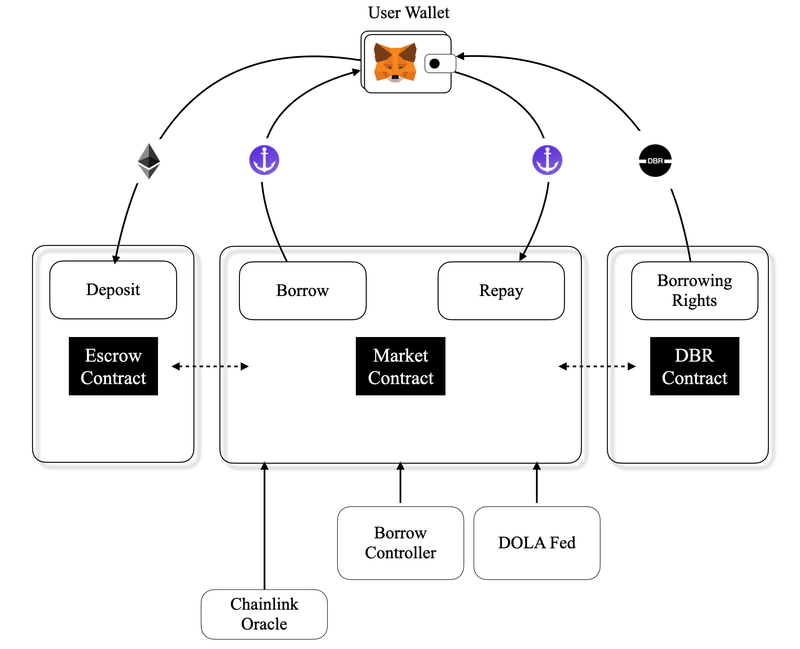

     /$$$$$$$$ /$$ /$$$$$$$  /$$      /$$
    | $$_____/|__/| $$__  $$| $$$    /$$$
    | $$       /$$| $$  \ $$| $$$$  /$$$$
    | $$$$$   | $$| $$$$$$$/| $$ $$/$$ $$
    | $$__/   | $$| $$__  $$| $$  $$$| $$
    | $$      | $$| $$  \ $$| $$\  $ | $$
    | $$      | $$| $$  | $$| $$ \/  | $$
    |__/      |__/|__/  |__/|__/     |__/
# Fixed Rates Market
FiRM is an over collateralized money market protocol for borrowing DOLA at a fixed price, over an arbitrary period of time. This is accomplished with the *Dola Borrowing Rights* (**DBR**) token.
One DBR token gives the right to borrow one DOLA for one year. As time progresses, DBR will be burnt from the borrower's wallet at a rate that depends on their debt. A borrower may repay their loan at any time, and sell their DBR at a potential profit, if interest rates have gone up.

## Architecture
Simplified overview of the FiRM architecture:

### Market
The market contract is the central contract of the FiRM protocol and contains most logic pertaining to borrowing and liquidations. A DOLA Fed mints DOLA to a market, which is then available to borrow for users holding DBR, using the Borrow function.

A borrow controller contract is connected to the market, which may add additional logic to who and how much is allowed to be borrowed.

If a borrower's credit limit falls below the value of their outstanding debt, a percentage of their collateral may be liquidated on behalf of the protocol. The liquidation carries an additional fee, which will be paid out to the liquidator, and may benefit protocol governance as well.

### DBR
The DBR contract is a non-standard ERC-20 contract. As a user borrows DOLA, DBR are slowly burned from the user’s wallet to pay for the borrowing. Since the burn rate is deterministic depending on the user's debt, it's only necessary to update the accrued debt whenever the borrower increase or decrease their debt position.

If a user's DBR balance falls below 0, the burn will continue as the user accrues a deficit. The user can be forced to replenish their DBR balance through a *forced replenishment*. Force replenishments will mint fresh DBR tokens to a user, a sufficiently high price, that it's unnecessary to  query an oracle about the market value of DBR tokens. To pay for the forced replenishment, additional DOLA debt is accrued to the borrower. Forced replenishments can be initiated by anyone and will immediately pay out  a percentage of the debt accrued by the action to the caller.

### Escrows
Each wallet has a unique escrow contract, one for every deployed market. Their primary purpose is holding a user’s collateral, but may have additional functionality that allow borrowers to use their collateral for voting, yield farming etc.

### Fed
Feds are a class of contracts in the Inverse Finance ecosystem responsible for minting DOLA in a way that preserves the peg and can't be easily abused. In the FiRM protocol, the role of the Fed is to supply and remove DOLA to and from markets.

# Set-up
FiRM is built using [Foundry](https://book.getfoundry.sh/getting-started/installation).

## Test
To run tests, you must first add an `RPC_MAINNET` rpc endpoint to your local `.env` file.

To generate a coverage summary run `forge coverage`, and `forge coverage --reprot lcov` for a full coverage report. To generate a human readable document from the lcov.info file, use the following command:
`genhtml -o report --branch-coverage`

